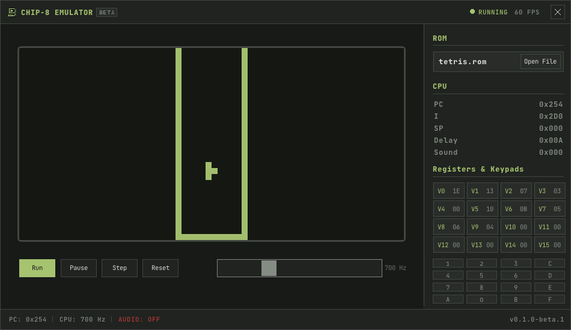

# 🕹️ CHIP-8 Emulator
A basic CHIP-8 elulator written in c++ using ralib and raygui.

Current version: v0.1.0-beta.1 🚧

## 📸 Screenshots

Add screenshots of the emulator here.

## 📥 Download

A ready-to-run .exe is available in the GitHub Releases section.

Download the latest release, extract it, and run the executable.

## 🔨 Building
Open the visual studio solution and build the project.

the `assets` folder contains the fonts and icons required by the app

